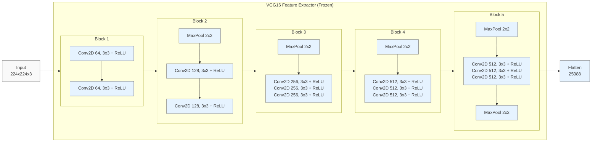
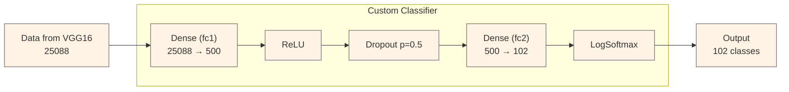

# AI Programming with Python Project

Project code for Udacity's AI Programming with Python Nanodegree program. In this project, students first develop code for an image classifier built with PyTorch, then convert it into a command line application.

## Image Classifier Project.ipynb

The `Image Classifier Project.ipynb` notebook contains the code and instructions for building an image classifier using PyTorch. This notebook guides you through the process of loading and preprocessing the data, defining and training a neural network, and testing the model's performance. Additionally, it includes steps to save the trained model and load it for making predictions on new images. The notebook is designed to be an interactive and educational tool for understanding the fundamentals of image classification with deep learning.

### VGG16 Feature Extractor (Frozen)
The "VGG16 Feature Extractor (Frozen)" graph represents the feature extraction part of the VGG16 neural network. This part of the network is pre-trained on the ImageNet dataset and is used to extract features from input images. The term "frozen" indicates that the weights of these layers are not updated during training, which helps in leveraging the pre-trained knowledge without modifying it. The graph is divided into several blocks, each containing convolutional layers followed by ReLU activation functions and max-pooling layers. The final output of this feature extractor is a flattened vector of size 25088.

### Custom Classifier
The "Custom Classifier" graph represents the custom classification part of the neural network that is added on top of the VGG16 feature extractor. This part of the network is trained on the specific dataset for the task at hand. It consists of a fully connected layer that reduces the 25088-dimensional input to 500 features, followed by a ReLU activation function, a dropout layer to prevent overfitting, another fully connected layer that reduces the 500 features to 102 classes, and a LogSoftmax layer to produce log-probabilities for each class. The final output is a vector of size 102, representing the probabilities for each class.

### Device Selection
The line `device = torch.device("cuda:0" if torch.cuda.is_available() else "cpu")` is used to select the device on which the computations will be performed. If a CUDA-compatible GPU is available, it will use the GPU (`cuda:0`), otherwise, it will fall back to using the CPU. This ensures that the code can run efficiently on systems with a GPU while still being compatible with systems that only have a CPU. The `print(device)` statement outputs the selected device to the console.

### Data Transformations

In the `Image Classifier Project.ipynb` notebook, we define transforms for the training, validation, and testing sets to preprocess the data before feeding it into the neural network. These transformations are crucial for several reasons:

1. **Data Augmentation (Training Set)**: For the training set, we apply random transformations such as rotation, resizing, and horizontal flipping. This helps in augmenting the dataset, making the model more robust and capable of generalizing better to new, unseen data. By exposing the model to various altered versions of the same images, we reduce the risk of overfitting.

2. **Normalization**: For all datasets (training, validation, and testing), we normalize the images by scaling the pixel values to a range of [0, 1] and then applying a standard normalization using the mean and standard deviation of the ImageNet dataset. This ensures that the input data has a consistent distribution, which helps in faster convergence during training and improves the model's performance.

3. **Resizing and Cropping (Validation and Testing Sets)**: For the validation and testing sets, we resize the images to a fixed size and then crop the center. This ensures that the images are of the same dimensions as required by the pre-trained networks, allowing for consistent and accurate evaluation of the model's performance.

By defining these transforms, we ensure that the data fed into the neural network is in the optimal format for training and evaluation, leading to better model performance and generalization.

### Label Mapping

The `cat_to_name.json` file is used to map the category labels to the actual names of the flowers. This JSON file contains a dictionary where the keys are the integer-encoded category labels and the values are the corresponding flower names. By loading this file, we can convert the predicted category labels from the model into human-readable flower names, making the output more interpretable and user-friendly.

### Build Your Network

In this section, we build and train a neural network for image classification using a pre-trained model from `torchvision.models`.

#### VGG

VGG (Visual Geometry Group) is a convolutional neural network architecture known for its simplicity and effectiveness. It consists of multiple convolutional layers followed by fully connected layers. VGG is a good choice for image classification tasks because:
- It has a simple and uniform architecture.
- It has been pre-trained on a large dataset (ImageNet), which helps in transfer learning.
- It achieves high accuracy on various image classification benchmarks.

Some good alternatives to VGG include:
- **ResNet (Residual Networks)**: Known for its deep architecture and skip connections, which help in training very deep networks.
- **Inception (GoogLeNet)**: Known for its inception modules that allow for more efficient computation.
- **DenseNet (Densely Connected Convolutional Networks)**: Known for its dense connections between layers, which improve information flow and gradient propagation.

#### Dropout

Dropout is a regularization technique used to prevent overfitting in neural networks. During training, dropout randomly sets a fraction of the input units to zero at each update step. This helps in making the model more robust and reduces the risk of overfitting by preventing the network from relying too much on any single neuron.

#### Sequential

The `nn.Sequential` module is a container that allows you to build a neural network by stacking layers in a sequential manner. It simplifies the process of defining the network architecture.

##### nn.Linear

`nn.Linear` is a fully connected layer that applies a linear transformation to the incoming data. It is defined by the number of input and output features.

##### nn.ReLU

`nn.ReLU` is an activation function that applies the Rectified Linear Unit (ReLU) function to the input. ReLU introduces non-linearity to the model, which helps in learning complex patterns.

##### LogSoftmax

`nn.LogSoftmax` is an activation function that applies the logarithm of the softmax function to the input. It is often used in the output layer of a classification network to produce log-probabilities for each class.

## Train

The `train` function is responsible for training the neural network. It takes the model, training data loader, validation data loader, loss criterion, optimizer, number of epochs, and device (CPU or GPU) as inputs. The function performs the following steps:

1. Moves the model to the specified device.
2. Iterates over the training data for the specified number of epochs.
3. For each batch of images and labels in the training data:
   - Moves the images and labels to the specified device.
   - Performs a forward pass through the model to get the output.
   - Computes the loss using the specified criterion.
   - Performs backpropagation to compute the gradients.
   - Updates the model parameters using the optimizer.
   - Accumulates the running loss.
4. Every `print_every` steps, evaluates the model on the validation data using the `evaluate` function and prints the training and validation loss and accuracy.

## Evaluate

The `evaluate` function is responsible for evaluating the model on a given data loader. It takes the model, data loader, loss criterion, and device as inputs. The function performs the following steps:

1. Moves the model to the specified device.
2. Sets the model to evaluation mode to turn off dropout.
3. Iterates over the data in the data loader:
   - Moves the images and labels to the specified device.
   - Performs a forward pass through the model to get the output.
   - Computes the loss using the specified criterion.
   - Computes the accuracy by comparing the predicted classes with the true labels.
4. Returns the average loss and accuracy over the entire data loader.

## Loading and Saving Checkpoints

### Saving Checkpoints

Saving checkpoints is crucial for preserving the state of your model during training. This allows you to resume training from a specific point without starting over, which is especially useful for long training processes. Checkpoints typically include the model's state dictionary, optimizer state, epoch number, and any other relevant information.

#### When to Save Checkpoints:  

* **During Long Training Sessions**: Save checkpoints periodically to avoid losing progress due to interruptions.
* **After Each Epoch**: Save at the end of each epoch to ensure you can resume from the last completed epoch.
* **Before Hyperparameter Tuning**: Save the model before experimenting with different hyperparameters to have a baseline to revert to.

### Loading Checkpoints

Loading checkpoints allows you to resume training from a saved state or use a pre-trained model for inference. This is useful for continuing interrupted training sessions or deploying a trained model without retraining.  

#### When to Load Checkpoints:  

* **Resuming Training**: Load a checkpoint to continue training from where it left off.
* **Inference**: Load a pre-trained model to make predictions on new data.
* **Transfer Learning:** Load a pre-trained model and fine-tune it on a new dataset.

## Training the Model

### Criterion and Optimizer

#### NLLLoss
`criterion = nn.NLLLoss()`

`nn.NLLLoss` stands for Negative Log Likelihood Loss. It is a loss function commonly used for classification tasks. This loss function expects the input to be log-probabilities (usually obtained from `nn.LogSoftmax`) and the target to be class indices. It measures the performance of a classification model whose output is a probability distribution over classes.

#### Adam Optimizer
`optimizer = optim.Adam(model.parameters(), lr=0.003)`

Adam (short for Adaptive Moment Estimation) is an optimization algorithm that can be used instead of the classical stochastic gradient descent to update network weights iteratively based on training data. Adam combines the advantages of two other extensions of stochastic gradient descent: Adaptive Gradient Algorithm (AdaGrad) and Root Mean Square Propagation (RMSProp). It computes adaptive learning rates for each parameter. The learning rate `lr=0.003` controls how much to change the model in response to the estimated error each time the model weights are updated.

### Training the Model
`train(model, train_loader, validation_loader, criterion, optimizer, epochs=1, print_every=40, device=device)`

This line calls the `train` function to train the model. The parameters are:
- `model`: The neural network model to be trained.
- `train_loader`: DataLoader for the training dataset.
- `validation_loader`: DataLoader for the validation dataset.
- `criterion`: The loss function (NLLLoss in this case).
- `optimizer`: The optimization algorithm (Adam in this case).
- `epochs=1`: The number of times the entire training dataset will pass through the network.
- `print_every=40`: Frequency of printing training and validation loss and accuracy.
- `device`: The device (CPU or GPU) on which the computations will be performed.

#### Epoch
An epoch is one complete pass through the entire training dataset. During an epoch, the model sees each training example once and updates its parameters based on the computed loss. Training for multiple epochs helps the model to learn better by iteratively adjusting the weights.

## Testing the Model

After training your model, it's important to test its performance on a separate test dataset that the model has never seen before. This helps to evaluate how well the model generalizes to new, unseen data.

### Evaluate Function

The `evaluate` function is responsible for evaluating the model on a given data loader. It takes the model, data loader, loss criterion, and device as inputs. The function performs the following steps:

1. Moves the model to the specified device.
2. Sets the model to evaluation mode to turn off dropout.
3. Iterates over the data in the data loader:
   - Moves the images and labels to the specified device.
   - Performs a forward pass through the model to get the output.
   - Computes the loss using the specified criterion.
   - Computes the accuracy by comparing the predicted classes with the true labels.
4. Returns the average loss and accuracy over the entire data loader.

### Testing the Model

Output the test loss and accuracy, providing an indication of the model's performance on the test dataset.

**Test Loss** and **Accuracy** are key metrics used to evaluate the performance of a machine learning model on a test dataset.

### Test Loss
- **Definition**: Test loss measures the error of the model's predictions on the test dataset. It is computed using a loss function, such as Mean Squared Error (MSE) for regression tasks or Negative Log Likelihood Loss (NLLLoss) for classification tasks.
- **Purpose**: It helps in understanding how well the model generalizes to new, unseen data. A lower test loss indicates better model performance.
- **Alternatives**: Depending on the task, other loss functions can be used, such as Cross-Entropy Loss for multi-class classification or Hinge Loss for SVMs.

### Accuracy
- **Definition**: Accuracy is the ratio of correctly predicted instances to the total instances in the test dataset. It is a straightforward metric for classification tasks.
- **Purpose**: It provides a simple measure of the model's performance in terms of the proportion of correct predictions.
- **Alternatives**: For imbalanced datasets, other metrics like Precision, Recall, F1-Score, and Area Under the ROC Curve (AUC-ROC) are more informative.

### Best Practices
1. **Use Appropriate Metrics**: Choose metrics that align with the problem's nature. For example, use F1-Score for imbalanced classification problems.
2. **Cross-Validation**: Use cross-validation to ensure the model's performance is consistent across different subsets of the data.
3. **Monitor Overfitting**: Compare training and test loss to detect overfitting. If the test loss is significantly higher than the training loss, the model may be overfitting.
4. **Regularization**: Apply regularization techniques like Dropout, L2 regularization, or early stopping to prevent overfitting.
5. **Hyperparameter Tuning**: Optimize hyperparameters using techniques like Grid Search or Random Search to improve model performance.

By following these best practices, you can ensure that your model is robust and performs well on unseen data.

### Image Preprocessing

The process_image function preprocesses the image so it can be used as input for the model. This function should process the images in the same manner used for training.

### Class Prediction

The predictor function uses a trained network for inference. It takes an image path and a model, then returns the top K most likely classes along with the probabilities.

### Sanity Checking

To ensure the model makes sense, use matplotlib to plot the probabilities for the top 5 classes as a bar graph, along with the input image.

